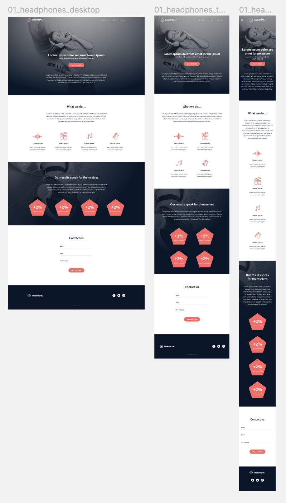

# 0x09 - Implementing A Design From Scratch

In this project, we will implement from scratch, without any library, a web page. Using all that we've learned previously from HTML/CSS/Accessibility/Responsive design concepts.

We are free to implement it the way we want, the objective is to have a fully functional webpage that looks the same as the designer file.

This final result should look like the given Figma document:

## Requirements

- Not allowed to import external CSS framework (like Bootstrap)
- Not allowed to use Javascript
- All HTML/CSS code is W3C compliant

## Tasks

### [0. Read and be familiar with Figma](./)

Open this project and “Duplicate to your Drafts” to have access to all design details.

### [1. Header](./0-index.html)

Building a web page the right way, is not easy - expect if you put in place strong foundations.

### [2. "What we do..." section](./1-index.html)

Try to build as generic as you can… you will probably need some components in next section.

### [3. "Our results" section](./2-index.html)

Now you can reuse components from the previous task!

### [4. Contact us](./3-index.html)

A good landing page has always a contact form.

You are free to add any animations and/or constraints on fields.

### [5. Footer](./4-index.html)

Last piece of the page… the Footer!

### [6. Replace image by... code!](./100-index.html)

In the section “Our results”, replace item background image by HTML and CSS only!

### [7. Let's animate items ](./101-index.html)

From **4-index.html** and **4-styles.css**, add fun animations to “What we do…” and “Our results” sections items row. Either all the time, either when hover.

Scaling, opacity, rotation, bouncing… many options!

### [8. And SASS??](./102-styles.css)

Take your 101-styles.css file and create a 102-styles.scss that will be the SASS version of it.

